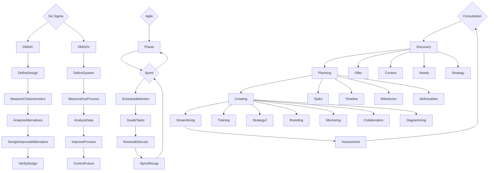

```mermaid
graph TD
    SixSigma{Six Sigma}
        SixSigma-->DMAIC-->DefineDesign-->MeasureCharecteristics-->AnalyzeAlternatives-->DesignImprovedAlternative-->VerifyDesign
        SixSigma-->DMADV-->DefineSystem-->MeasureKeyProcess-->AnalyzeData-->ImproveProcess-->ControlFuture

    Agile{Agile}
        Sprint{Sprint}

        Sprint-->Schedule&Monitor-->Goal&Tasks-->Review&Discuss-->SprintRecap-->Sprint

        Agile-->Phase-->Sprint-->Phase

    Consultation{Consultation}
        Consultation-->Discovery-->Planning-->Creating-->Streamlining
            Discovery-->Offer
            Discovery-->Context
            Discovery-->Needs
            Discovery-->Strategy

            Planning-->Tasks
            Planning-->Timeline
            Planning-->Milestones
            Planning-->Deliverables

            Creating-->Training
            Creating-->Strategy2
            Creating-->Branding
            Creating-->Mentoring
            Creating-->Collaboration
            Creating-->Diagramming

            Streamlining-->Assessment-->Consultation
``` 